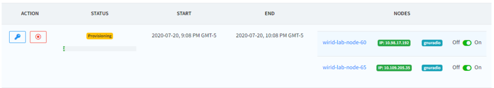
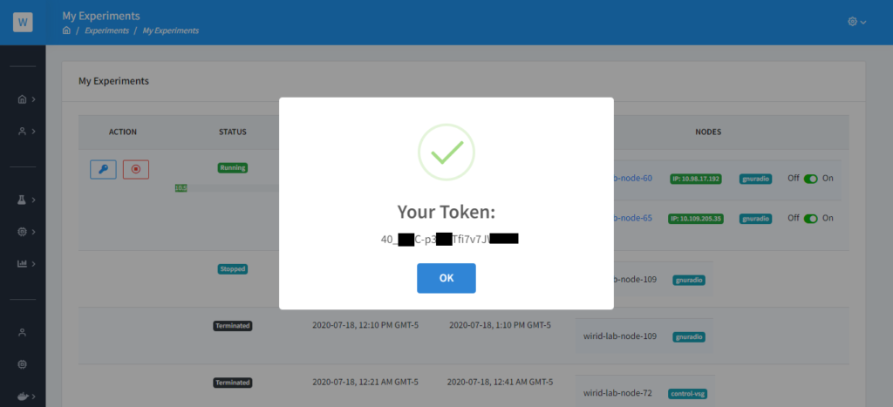
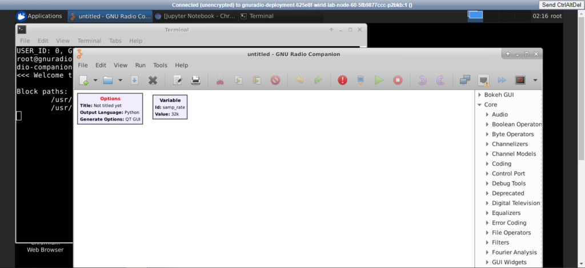
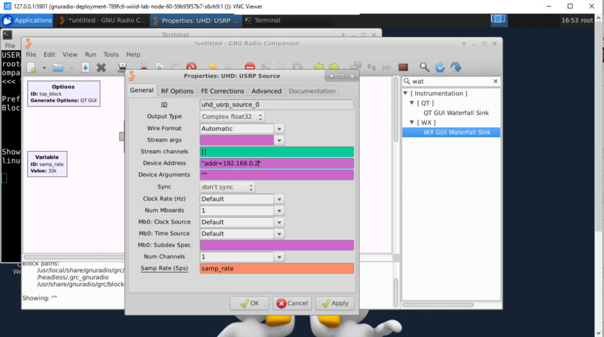
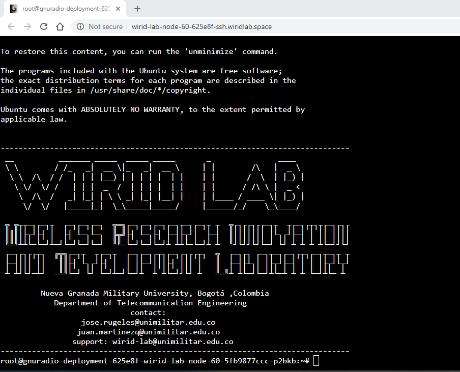
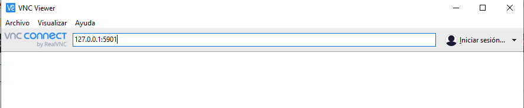
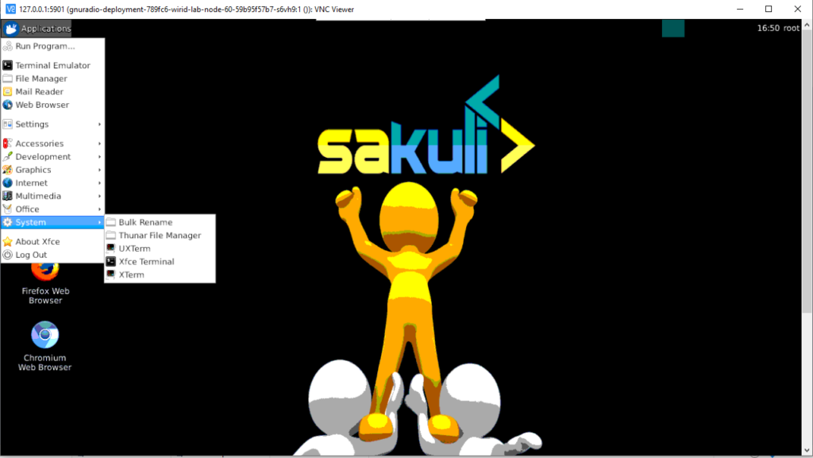
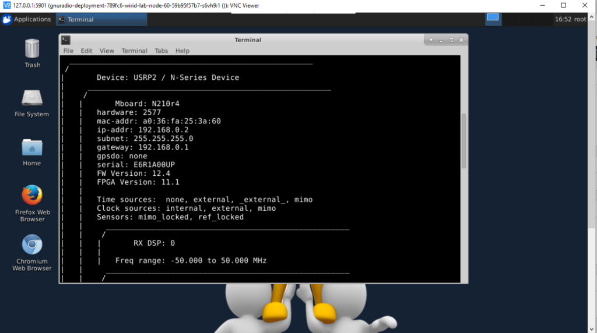

## Introducción
Este tutorial muestra cómo ejecutar la herramienta GNU Radio para controlar el equipos USRP de la infraestructura del laboratorio, para ello realice lo siguiente:

- Haber cargado las claves SSH a la plataforma  y haber creado el experimento con los nodos  del laboratorio. Si no sabe cómo realizar este paso diríjase a la guía de inicio rápido [AQUÍ](./../started.mdx)

Para este ejemplo vamos a crear un experimento con los nodos USRP **wirid-lab-node-60** y **wirid-lab-node-65**

### Puertos utilizados en esta aplicación:
Si desea  controlar el nodo mediante el  acceso avanzado tenga en cuenta la siguiente lista de puertos que se exponen en cada nodo.

- 2022 para ingresar mediante SSH a cada nodo (Usuario: root  y contraseña utilizar token de reserva)
- 8080 para ingresar al notebook Jupyter
- 4200 para ingresar por SSH Web
- 6901 para ingresar por VNC Web
- 5901 para ingresar por aplicación VNC


### Direcciones IP USRP
Todos los radios USRP tienen la dirección IP ```192.168.0.2```
Al realizar el despliegue de la aplicación automáticamente se clona en la ruta  /headless/root de cada nodo el repositorio https://github.com/wirid-lab/gnuradio-examples con ejemplos que pueda utilizar.

## Acceso mediante interfaz WEB
 
- Al iniciar el experimento verá que la aplicación se encuentra en estado Provisioning esto indica que la aplicación se está desplegando en cada uno de los nodos e iniciando cada uno de los puertos, el tiempo de aprovisionamiento es de 1 a 2 minutos.  Una vez el estado se encuentre en Running puede ingresar a la aplicación Jupyter, SSH Web y VNC Web

  


- Para acceder a cada una de estas aplicaciones le será solicitada una contraseña,  esta se  encuentra al hacer clic sobre el icono de llave en My Experiments . El token es una cadena alfanumérica única e irrepetible que identifica los nodos con la reserva.


  


### Escritorio Remoto (VNC)

- Seleccione la opción VNC en **My Experiments**
- Una vez ingresa al escritorio remoto, abra un terminal ejecutando el comando **gnuradio-companion**, inmediatamente se abrirá una ventana con la aplicación.
 
   

- Cree sus programas o utilice los programas de ejemplo.
- Si desea utilizar los notebooks jupyter dentro del escritorio remoto, abra una pestaña de cualquier navegador e ingrese **http://localhost:8080**
- Si quiere verificar la información del radio, abra un terminal dentro de la interfaz y utilice el comando  ```uhd_usrp_probe --args="addr=192.168.0.2"``` , este dará información completa del equipo. 
- Si desea transmitir o recibir señales de la USRP, configure el parámetro ``` Device Addres: "addr=192.168.0.2" ``` en los bloques UHD.

   

- Guarde el espacio de trabajo y ejecute el programa. Si recibe una advertencia de xtem omitala.

### SSH Web

- Seleccione la opción SSH en **My Experiments**
- Indique el usuario **root**
- Ingrese el token de la reserva como contraseña haciendo click derecho y seleccionar la opción **Paste from browser**
- Oprimir la tecla «Enter»


   

### Jupyter
- Seleccione la opción Jupyter en **My Experiments**
- Ingrese el token de la reserva como contraseña 
 

## Acceso avanzado 

Cuando el estado cambia a running, una dirección IP será asignada a cada nodo, para este ejemplo tenemos 10.98.17.192 para el nodo 60  y 10.109.205.35 para el nodo 65. 


### Preparar Conexión al laboratorio

Para realizar la conexión avanzada al laboratorio es posible mediante la configuración del archivo **config** ubicado en la carpeta **.ssh** o mediante algún programa externo como PUTTY. A continuación se mencionan las dos opciones.

#### **Archivo Config** 

Elimine el archivo **known_hosts** y modifique su archivo **config** con la siguiente información

```sh
Host wirid-lab
    HostName wirid-lab.umng.edu.co
    User guestuser
    Port 2222
    IdentityFile ~/.ssh/id_rsa
    #Configuracion para el nodo 60
    LocalForward 5901 10.98.17.192:5901
    LocalForward 6901 10.98.17.192:6901
    LocalForward 2022 10.98.17.192:2022
    LocalForward 81 10.98.17.192:8080
    LocalForward 4200 10.98.17.192:4200
    #Configuracion para el nodo 65
    LocalForward 5902 10.109.205.35:5901
    LocalForward 6902 10.109.205.35:6901
    LocalForward 2023 10.109.205.35:2022
    LocalForward 82 10.109.205.35:8080
    LocalForward 4201 10.109.205.35:4200
```

Tenga en cuenta que para cada nodo debe asignar puertos locales diferentes.

Conectarse por el terminal o powershell mediante el comando ```ssh wirid-lab```


#### Putty

Realizar las siguientes configuraciones en la opción Tunneling
- Puerto local 5901 para 10.98.17.192:5901
- Puerto local 6901 para 10.98.17.192:6901
- Puerto local 2022 para 10.98.17.192:2022
- Puerto local 81 para 10.98.17.192:8080

### Conexion a los nodos

#### Escritorio Remoto (VNC)

- Descargar un cliente VNC, se recomienda utilizar [VNC VIWER](https://www.realvnc.com/es/connect/download/viewer/)
- Una vez descargado e instalado ingresar la dirección ip **127.0.0.1:5901**  para conectarse al nodo 60  y **127.0.0.1:5902** para conectarse al nodo 65



- Si desea conectarse mediante el navegador de internet, ingrese **http://127.0.0.1:6901** para el nodo 60 y  **http://127.0.0.1:6902** para el nodo 65.
- Una vez ingresa a la  interfaz remota del nodo ya puede iniciar con el control del radio USRP.
- Si quiere verificar la información del radio, abra un terminal Xfce dentro de la interfaz y utilice el comando ```uhd_usrp_probe --args="addr=192.168.0.2"``` , este dará información completa del equipo. 






- Para utilizar gnuradio ingrese  el comando ```gnuradio-compainion```
- Si desea transmitir o recibir señales de la USRP, configure el parámetro  ```Device Addres: "addr=192.168.0.2" ``` en los bloques UHD.


Guarde el espacio de trabajo y ejecute el programa. Si recibe una advertencia de xtem omitala.
#### SSH Web
- Ingrese desde su navegador a http://127.0.0.1:4200 para el nodo 60 o http://127.0.0.1:4201 para el nodo 65
- Indique el usuario root
- Ingrese el token de la reserva como contraseña haciendo click derecho y seleccionar la opción Paste from browser

#### SSH 
- Abra un terminal e ingrese ```ssh -p 2022 root@127.0.0.1 -o StrictHostKeyChecking=no``` para el nodo 60
- Abra un terminal e ingrese ```ssh -p 2023 root@127.0.0.1 -o StrictHostKeyChecking=no``` para el nodo 65
- Ingrese el token de la reserva como contraseña

#### Jupyter
- Ingrese desde su navegador a http://127.0.0.1:81 para el nodo 60 o http://127.0.0.1:82 para el nodo 65
- Ingrese el token de la reserva como contraseña 
 


:::caution
Tenga en cuenta el tiempo de la reserva para guardar sus archivos ya que una vez finalizada la reserva el sistema cierra todas las  conexiones y los datos  trabajados se perderán.
:::

:::info
Los puertos locales pueden se configurados a su gusto, no se exige la misma configuración.
:::