## Introducción

Este tutorial muestra cómo crear una red LoRa  privada mediante ChirpStack utilizando nuestros gateways con RPi3  y nodos LoRa en el laboratorio WIRID-LAB.
En este tutorial utilizaremos el nodo **wirid-lab-node-20** que corresponde a un gateway LoRa.

## Configuración Gateway

Una vez creada la reserva, podrá ingresar al servidor web del gateway mediante la URL asignada por el laboratorio.

Digite en usuario y contraseña ```admin``` para ingresar al panel de control.


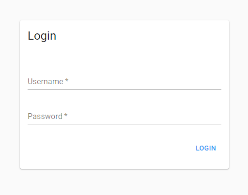


Una vez haya ingresado al panel de control, realizar a las siguientes configuraciones: 

### Network-servers

- Pestaña General
  - **Network-server-name**: chirpstack-network-server
  - **Network-server-server**: localhost:8000

- Pestaña Gateway Discovery
  - Enable Gateway Discovery
  - **Interval**: 100
  - **Tx Frequency**: 60
  - **Tx data-rate**: 60

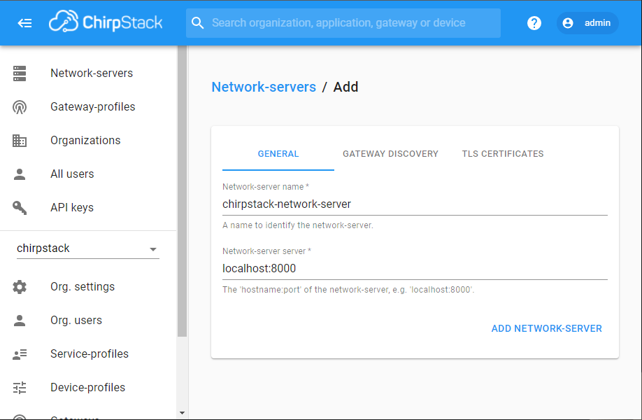

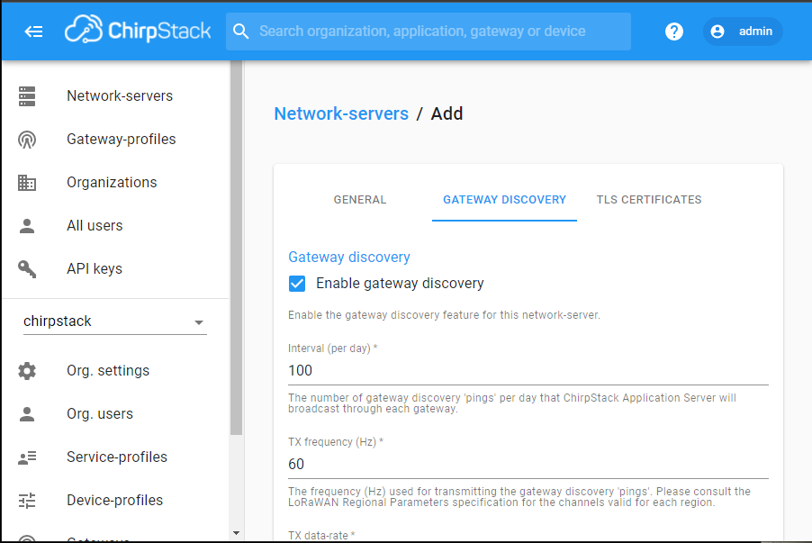

### Service-profiles

- **Service-profile Name**: IOTSERV
- **Network-server**: chirpstack-network-server
- **Device-status request Frequency**: 48
- **Minimum allowed data-rate**: 10
- **Maximum allowed data-rate**: 10


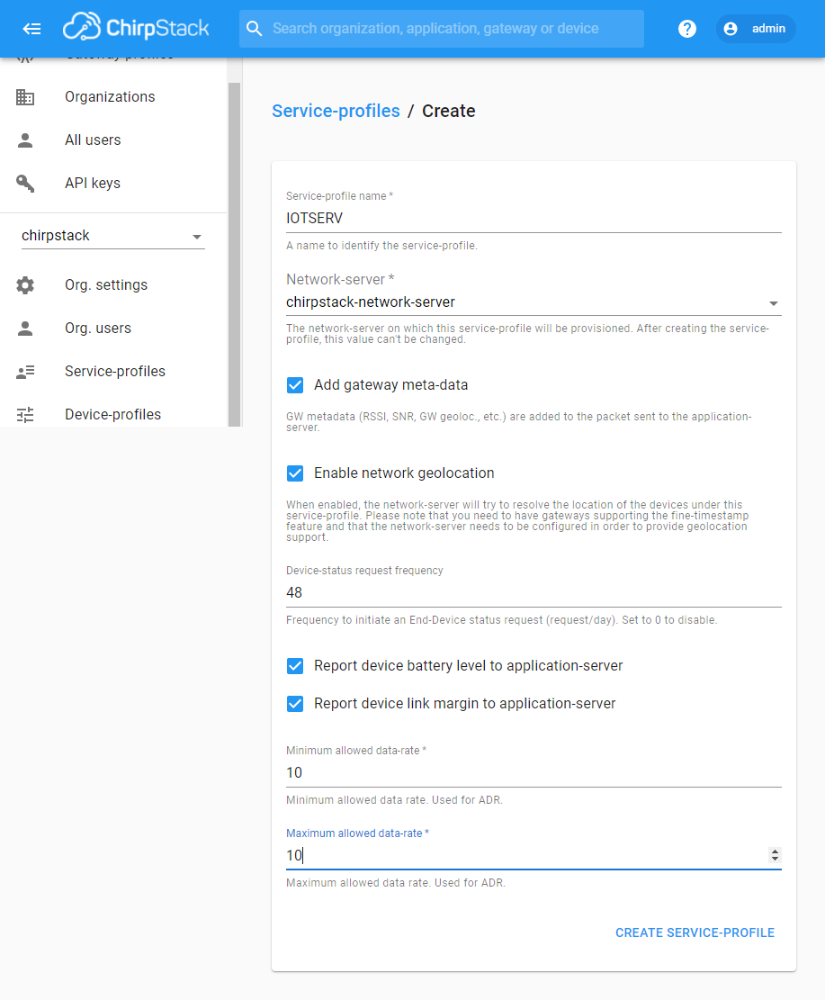


### Organization


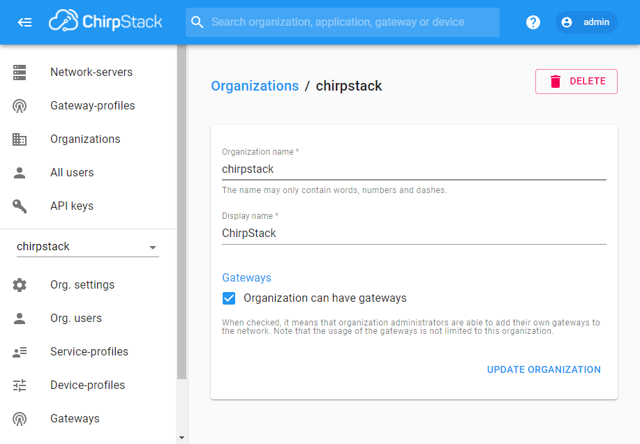


### Device-profile

- Pestaña General
  - **Device-profile name**: IOTDEV
  - **Network-server**: chirpstack-network-server
  - **LoRaWAN MAC Version**: 1.0.2
  - **LoRaWAN Region**: B

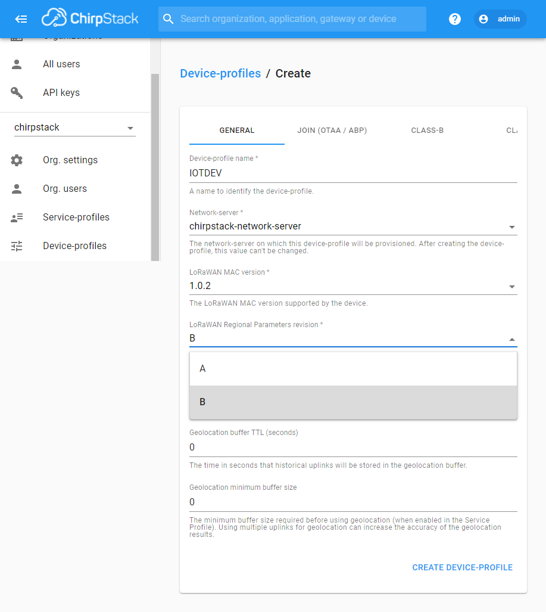


- Pestaña *JOIN (OTTA/ABP)*
  - **Factory-preset Frequency (Hz)**: 915000000 


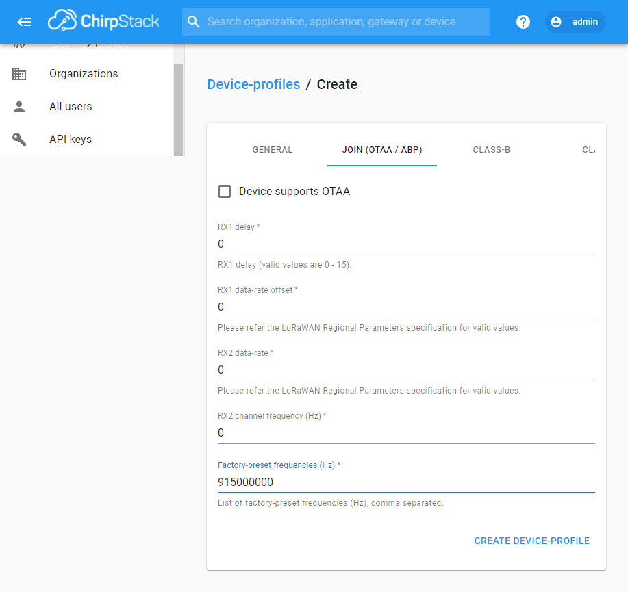


- Pestaña *CLASS-B*
  - **Class-B confirmed downlink timeout**: 30
  - **Class-B ping-slot**: every 2 seconds
  - **Class-B ping-slot data-rate**: 5
  - **Class-B ping-slot Frequency(Hz)**: 1


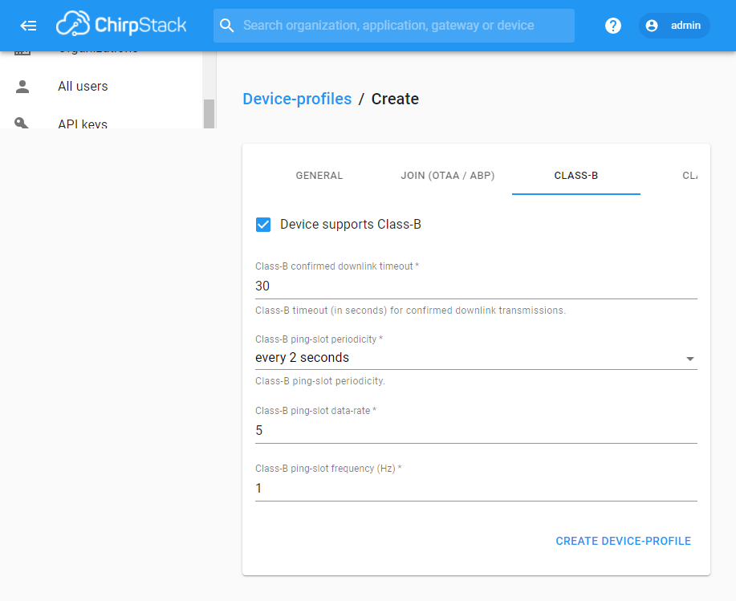


### Gateway-profiles

- **Name**: IOTGATEWAY
- **Enable Channels**: 0,1,2
- **Network-server**: chirpstack-network-server
- **Modulation**: LoRa
- **Bandwidth**: 125kHz
- **Frequency**: 915000000
- **Spreading-factors**: 7,8,9,10,11,12

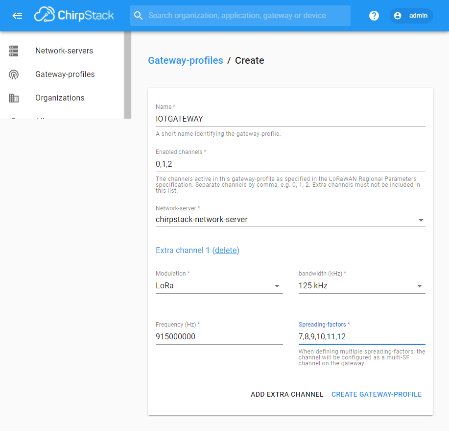


```js
// Decode decodes an array of bytes into an object.
//  - fPort contains the LoRaWAN fPort number
//  - bytes is an array of bytes, e.g. [225, 230, 255, 0]
// The function must return an object, e.g. {"temperature": 22.5}
function Decode(fPort, bytes) {
  var decoded = {};
  var hexString=bin2HexStr(bytes);
  return rakSensorDataDecode(hexString);
}

// convert array of bytes to hex string.
// e.g: 0188053797109D5900DC140802017A0768580673256D0267011D040214AF0371FFFFFFDDFC2E
function bin2HexStr(bytesArr) {
  var str = "";
  for(var i=0; i<bytesArr.length; i++) {
    var tmp = (bytesArr[i] & 0xff).toString(16);
    if(tmp.length == 1) {
      tmp = "0" + tmp;
    }
    str += tmp;
  }
  return str;
}

// convert string to short integer
function parseShort(str, base) {
  var n = parseInt(str, base);
  return (n << 16) >> 16;
}

// convert string to triple bytes integer
function parseTriple(str, base) {
  var n = parseInt(str, base);
  return (n << 8) >> 8;
}

// decode Hex sensor string data to object
function rakSensorDataDecode(hexStr) {
  var str = hexStr;
  var myObj = {};

  while (str.length > 4) {
    var flag = parseInt(str.substring(0, 4), 16);
    switch (flag) {
      case 0x0768:// Humidity
        myObj.humidity = parseFloat(((parseShort(str.substring(4, 6), 16) * 0.01 / 2) * 100).toFixed(1));//unit:%RH
        str = str.substring(6);
        break;
      case 0x0673:// Atmospheric pressure
        myObj.barometer = parseFloat((parseShort(str.substring(4, 8), 16) * 0.1).toFixed(2));//unit:hPa
        str = str.substring(8);
        break;
      case 0x0267:// Temperature
        myObj.temperature = parseFloat((parseShort(str.substring(4, 8), 16) * 0.1).toFixed(2));//unit: °C
        str = str.substring(8);
        break;
      case 0x0188:// GPS
        myObj.latitude = parseFloat((parseTriple(str.substring(4, 10), 16) * 0.0001).toFixed(4));//unit:°
        myObj.longitude = parseFloat((parseTriple(str.substring(10, 16), 16) * 0.0001).toFixed(4));//unit:°
        myObj.altitude = parseFloat((parseTriple(str.substring(16, 22), 16) * 0.01).toFixed(1));//unit:m
        str = str.substring(22);
        break;
      case 0x0371:// Triaxial acceleration
        myObj.acceleration_x = parseFloat((parseShort(str.substring(4, 8), 16) * 0.001).toFixed(3));//unit:g
        myObj.acceleration_y = parseFloat((parseShort(str.substring(8, 12), 16) * 0.001).toFixed(3));//unit:g
        myObj.acceleration_z = parseFloat((parseShort(str.substring(12, 16), 16) * 0.001).toFixed(3));//unit:g
        str = str.substring(16);
        break;
      case 0x0402:// air resistance
        myObj.gasResistance = parseFloat((parseShort(str.substring(4, 8), 16) * 0.01).toFixed(2));//unit:KΩ
        str = str.substring(8);
        break;
      case 0x0802:// Battery Voltage
        myObj.battery = parseFloat((parseShort(str.substring(4, 8), 16) * 0.01).toFixed(2));//unit:V
        str = str.substring(8);
        break;
      case 0x0586:// gyroscope
        myObj.gyroscope_x = parseFloat((parseShort(str.substring(4, 8), 16) * 0.01).toFixed(2));//unit:°/s
        myObj.gyroscope_y = parseFloat((parseShort(str.substring(8, 12), 16) * 0.01).toFixed(2));//unit:°/s
        myObj.gyroscope_z = parseFloat((parseShort(str.substring(12, 16), 16) * 0.01).toFixed(2));//unit:°/s
        str = str.substring(16);
        break;
      case 0x0902:// magnetometer x
        myObj.magnetometer_x = parseFloat((parseShort(str.substring(4, 8), 16) * 0.01).toFixed(2));//unit:μT
        str = str.substring(8);
        break;
      case 0x0a02:// magnetometer y
        myObj.magnetometer_y = parseFloat((parseShort(str.substring(4, 8), 16) * 0.01).toFixed(2));//unit:μT
        str = str.substring(8);
        break;
      case 0x0b02:// magnetometer z
        myObj.magnetometer_z = parseFloat((parseShort(str.substring(4, 8), 16) * 0.01).toFixed(2));//unit:μT
        str = str.substring(8);
        break;
      default:
        str = str.substring(7);
        break;
    }
  }

  return myObj;
}


```


### Gateways

- **Gateway Name**: IOTGATEWAY
- **Gateway Description**: IOTGATEWAY
- **Gateway ID**: b827ebfffe30d253
- **Network-server**: chirpstack-network-server

:::info
El dato  **Gateway ID** corresponde al ID del gateway reservado, esta información se puede encontrar en los detalles del nodo.
:::


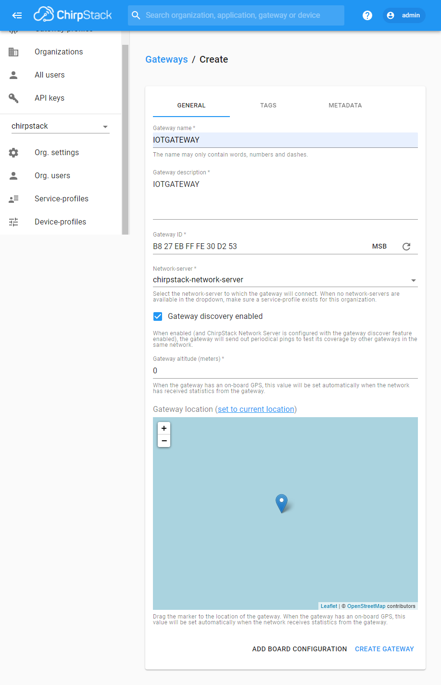


### Application

- **Aplication name**: IOTAPP
- **Aplication description**: IOTAPP
- **Service-profile**: IOTSERV

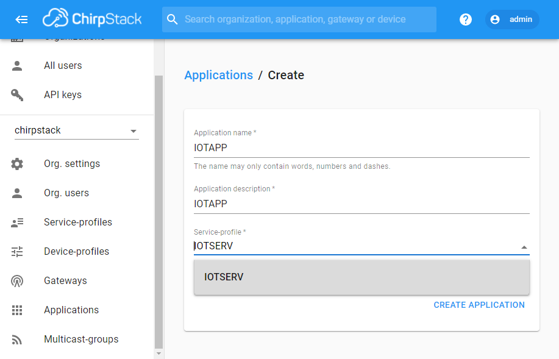


### Asociar Nodo 

- Ingresar a **Applications** y seleccionar  **IOTAPP** y crear el dispositivo.

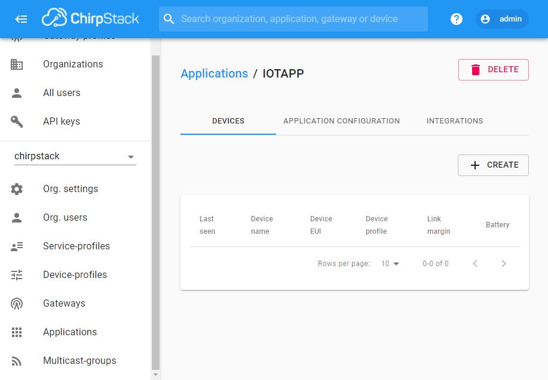

Para este ejemplo usaremos el dispositivo **RAK5205**, para ello relice las siguientes configuraciones.

- **Device name**: RAK5205
- **Device description**: RAK5205
- **Device EUI**:  Generar aleatoriamente
- **Device-profile**: IOTDEV
- Habilitar opción **Disable frame-counter validation**
- *Create device*

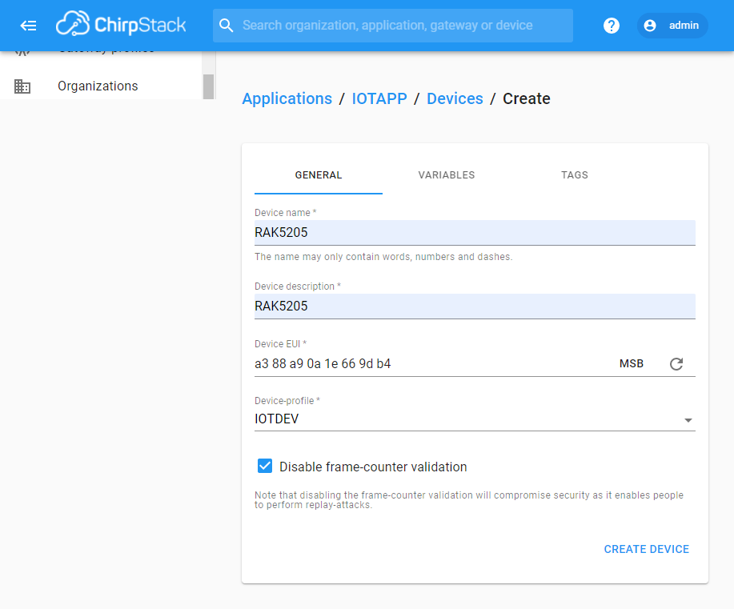

- Creado el dispotivo, se abre la pestaña **ACTIVATION**
- Para los campos *Device address*, *Network session key* y *Application session key* generar los valores aleatoriamente
- *(RE)Activate device*

:::info
Los campos *Device address*, *Network session key* y *Application session key* deben ser configurados en el dispositvo para establecer la comunicación con el gateway
:::

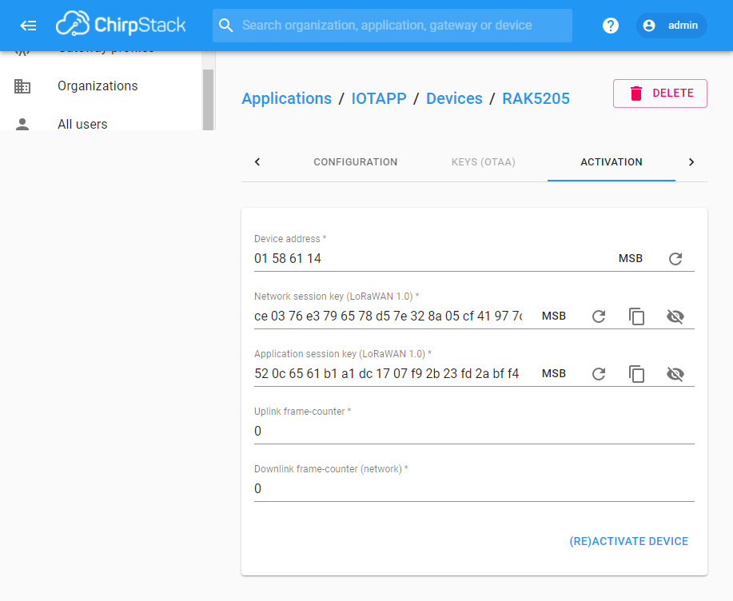


### Validar Conexión  Gateway

Una vez realizadas las configuraciones del gateway, se puede validar la conexión al ingresesar a **Gateways** y verificar la última vez conectado.

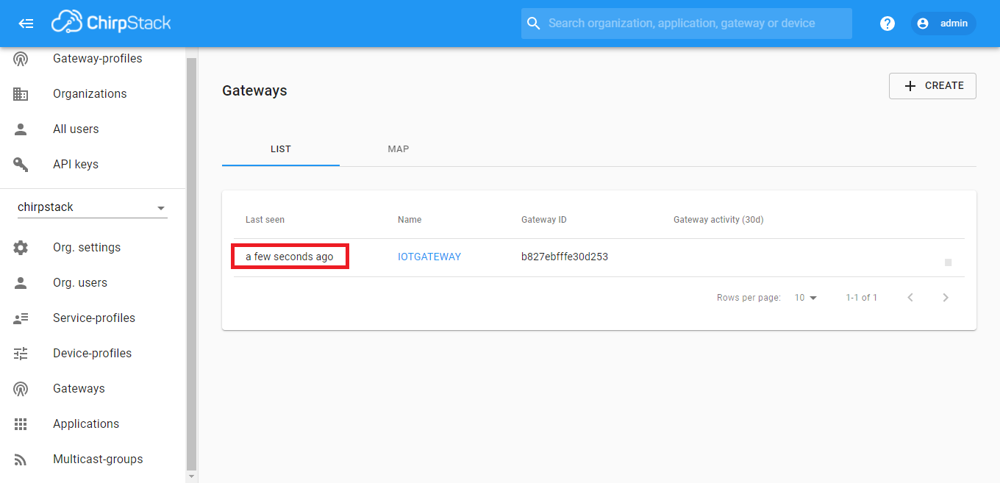


## Configuración Nodo
