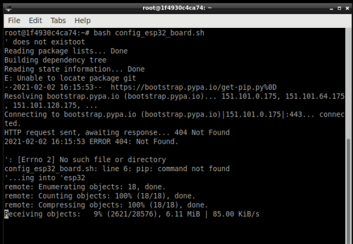

## Introducción


Este tutorial muestra cómo realizar la Configuración de un nodo heltec ESP32 LoRa v1 que se conecta a una RPi3 y se configura desde un contenedor que ejecuta un sistema operativo linux.


## Configuración Contenedor

Una vez creada la reserva, podrá ingresar al servidor web del gateway mediante la URL asignada por el laboratorio.

## Puertos utilizados en esta aplicación:

- 2022 para ingresar mediante SSH al nodo (Usuario: root  y contraseña utilizar token de reserva)
- 5901 para ingresar mediante un cliente VNC (Usuario: root  y contraseña utilizar token de reserva)

## SSH Web
- Seleccione la opción SSH en **My Experiments**
- Ingrese con el usuario **root**
- Ingrese el token de la reserva como contraseña haciendo click derecho y seleccionar la opción **Paste from browser**
- Oprimir la tecla «Enter»Una vez haya ingresado al panel de control, realizar a las siguientes configuraciones: 


## VNC
- Seleccione la opción VNC en **My Experiments**
- Abra su cliente VNC
- Para ingresar por este metodo utilice la URL asignada por el laboratorio, la cual tiene un formato como el siguiente **http://wirid-lab-node-58-e9bd84-vnc.wirid-lab.umng.edu.co/**
- Ingrese el token de la reserva como contraseña 


### Configurando desde VNC
Una vez que se encuentre en el escritorio de VNC, abra una consola de terminal y ejecute de manera consecutiva los siguientes pasos:


- Clone el repositorio en el cual se cuenta con los recursos e información necesaria para configurar el modulo, para lo cual debe ejecutar
````
git clone https://github.com/wirid-lab/lora-chirpstack-resources.git
````


- Ingrese al directorio que se ha descargado utilizando el comando ````cd /lora-chirpstack-resources/Heltec````

- Ejecute el archivo **.sh** para instalar la el gestor de tarjetas ESP32 en Arduino, utilizando el comando:
````
bash config_esp32_board.sh
````



- Espere a que termine de instalarse, y proceda a configurar las librerias necesarias, 
las cuales se encuentran en la carpeta **Heltec** en el repositorio descargado anteriormente como un archivo **.zip**

- Para descomprimir el archivo y enviarlo a la ruta en la cual debe esta, ingrese en su terminal el comando
````
cd
unar -o Arduino/ lora-chirpstack-resources/Heltec/ESP32_Heltec_Libraries.zip
````
Comando que permitira descomprimir la carpeta en el directorio en el cual se encuentra el programa de Arduino.


- Dirijase al gestor de archivos, y abra el directorio donde se descomprimio el contenido de la carpeta **.zip**, en donde debe identificar
el directorio con Nombre ESP32_Heltec_Libraries, ingresar hasta la ruta **/root/Arduino/ESP32_Heltec_Libraries/libraries** y copiar todos los directorios que se encuentran en el subdirectorio **libraries**


- Regrese a la ruta **/root/Arduino/libraries** y pegue los directorios copiados en el interior del directorio **libraries**


- Cierre el gestor de archivos y continue

- Ingrese nuevamente al terminal y ejecute el comando 

````
cd
cp -r lora-chirpstack-resources/Heltec/abp_chirpstack_us915_dht11 Arduino/
cp -r lora-chirpstack-resources/Heltec/abp_chirpstack_us915_dht11_OLED Arduino/
````
- Cierre la terminal y proceda a ejecutar el IDE de Arduino, siguiendo el camino **Inicio >> Programas >> Arduino**


- En el IDE de Arduino siga la ruta **File >> Sketchbook** y seleccione el ejemplo copiado anteriormente **abp_chirpstack_us915_dht11**


- Dirijase al aplicativo de lora Chirpstack para obtener los datos de activacion del nodo, el cual corresponde a otro servicio que se debe lanzar y corresponde a Lora gateway


- Ingrese los datos identificados en el codigo de Arduino, de modo que el dispositivo se active correctamente en la plataforma chirpstack


