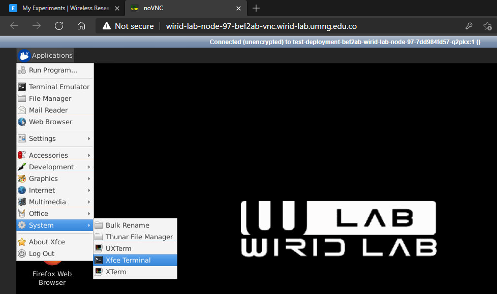
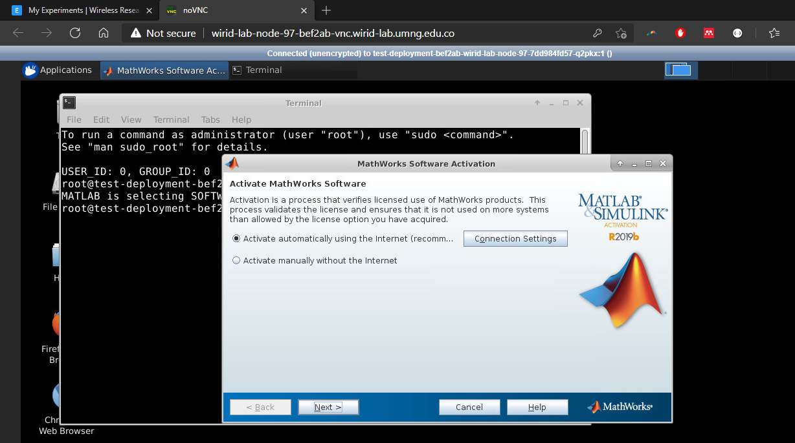
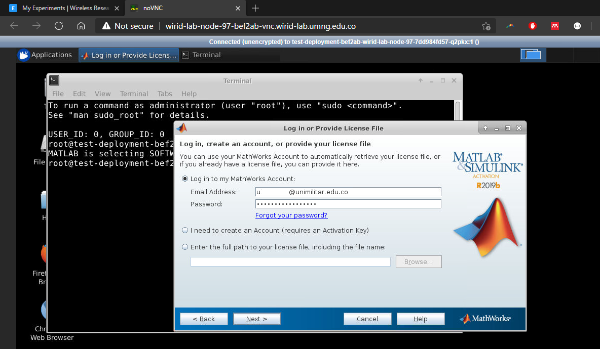
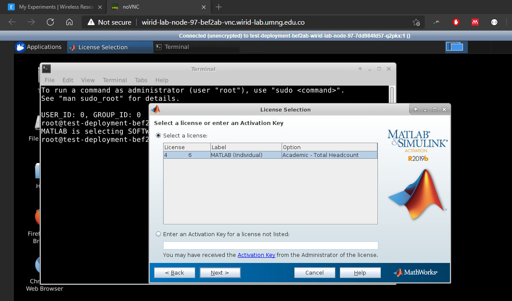
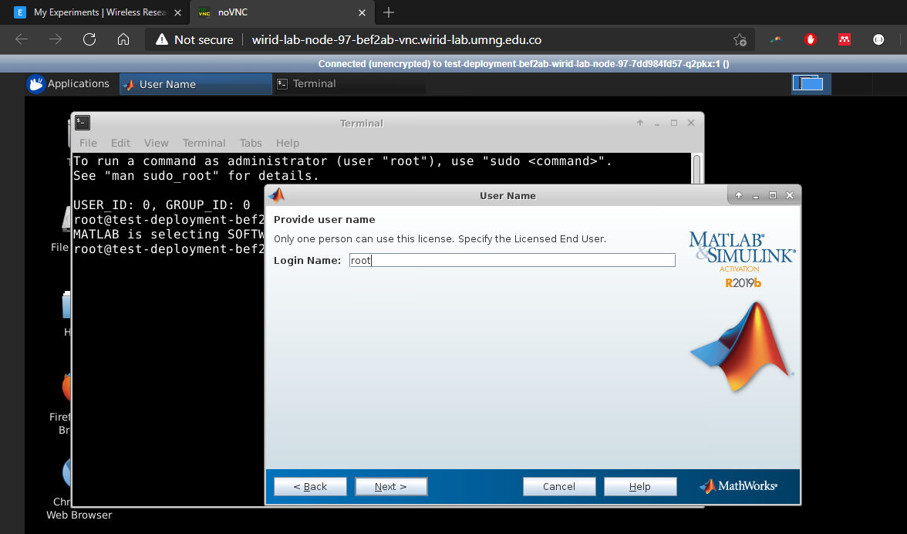
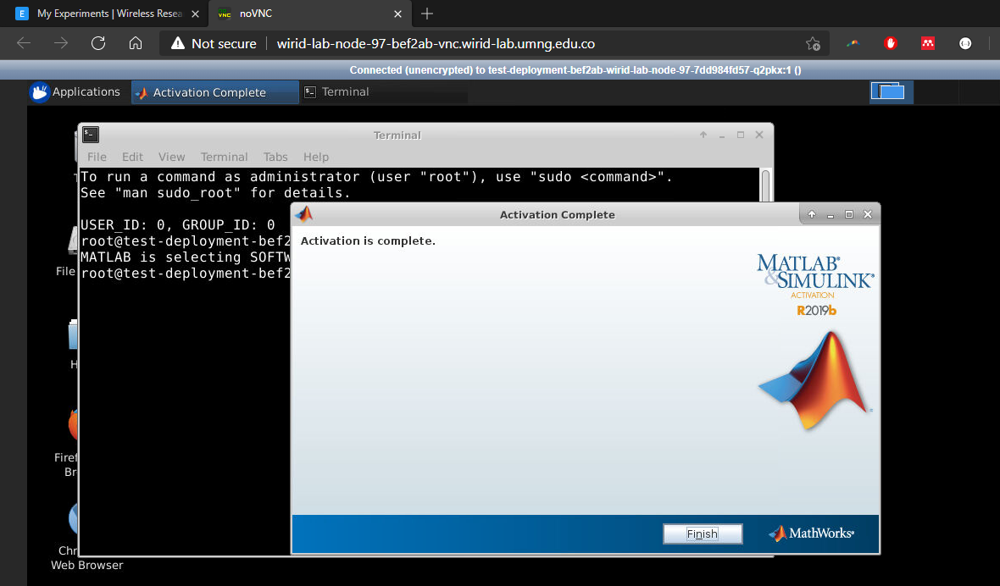
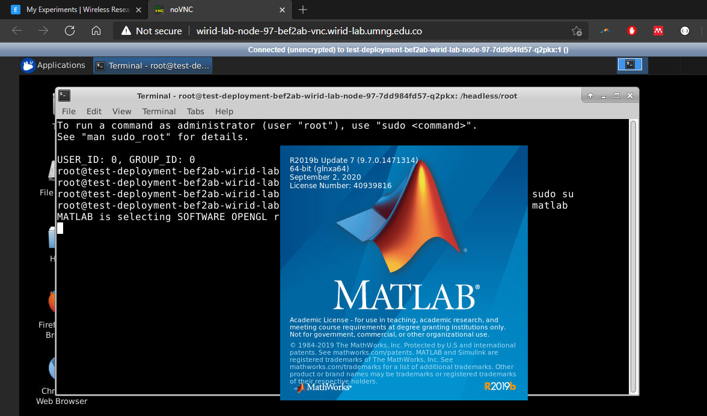
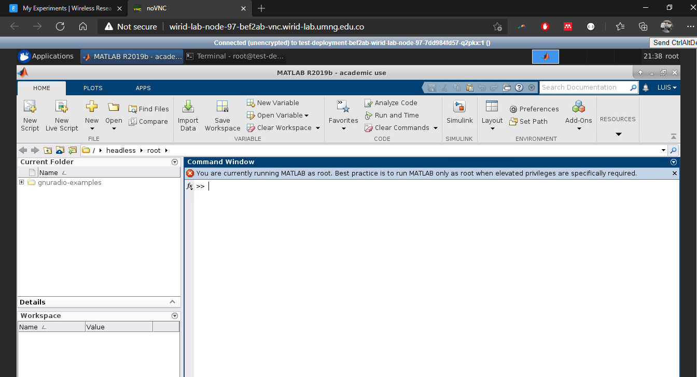

El laboratorio cuenta con una versión pre-instalada de MATLAB 2019b para dispositivos Linux. Para utilizarla debe contar con una cuenta en [MathWorks](https://mathworks.com/) que permita activar por internet el equipo.
Si no tiene una cuenta, registrese utlizando el correo **@unimilitar.edu.co** .

:::info
La Universidad Militar Cuenta con un licenciamiento educativo, una vez se registre en MathWorks, automáticamente identifica el correo y la licencia adquirida por la UMNG.
:::


Recuerde que para utilizar Matlab siempre debe realizar estos pasos para activar la licencia.


## Activación Matlab

- Abra un terminal Xfce  y escriba el comando ```matlab```, inmediatamente se abrirá una la ventana de activación de licencia de MathWorks.




- Selecicone la opción *activar automáticamente usando internet* e ingrese con el correo y contraseña creado en Mathworks.



- Seleccione el tipo de licencia, para este caso usaremos la licencia académica.




- En nombre de login ingresar **root**.



- Hacer clic en continuar y confirmar para activar la licencia, verá un mensaje como en la siguiente imágen.



- Con la licencia activada para trabajar en el experimento, ingrese en modo root mediante el comando ```sudo su```
- Ejecutar matlab mediante el comando ```matlab```





- Utilice matlab de acuerdo a su objetivo.  Recuerde que en nuestro repositorio https://github.com/wirid-lab puede encontrar diferentes recursos para el uso del laboratorio.

:::info
Este tutorial se hace con el proposito de activar las licencias de la UMNG.
::