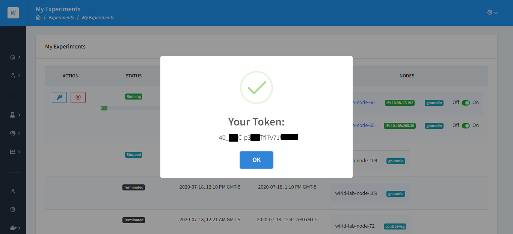
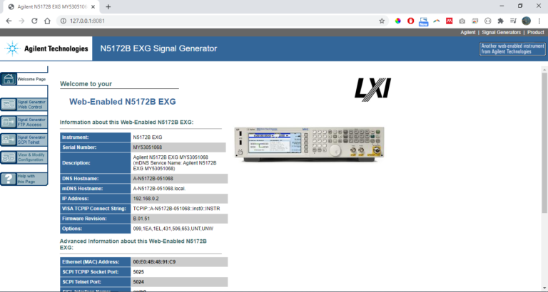
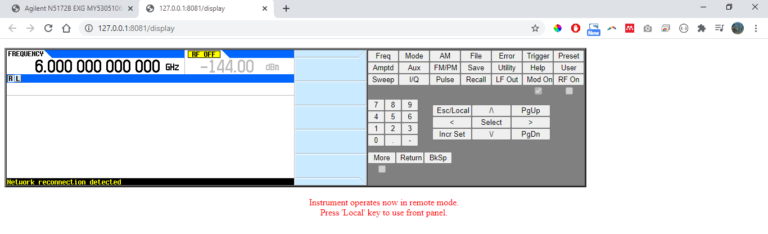
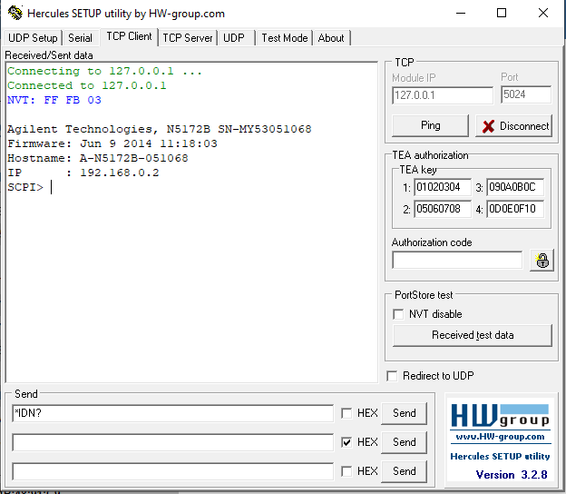

# Control VSG Keysight N5172B


Este tutorial muestra cómo realizar el control del generador vectorial (VSG)  [Keysight N5172B](https://gissic.umng.edu.co/wirid-lab/es/vsg-keysight-n5172b-exg/)  mediante los notebooks de Jupyter o mediante el acceso avanzado donde pueda controlar el equipo mediante matlab / R / Python o cualquier otro software mediante los puertos de control. 

El generador vectorial se encuentra conectado una RaspberryPI3 mediante una conexión FastEthernet.

Para controlar este equipo durante su experimento recuerde haber cargado las claves SSH a la plataforma  y haber creado la reserva con los nodos  del laboratorio. Si no sabe cómo realizar este paso diríjase a la guía de inicio rápido [AQUÍ](./../started.mdx)

El nodo encargado asignado para este experimento es : **wirid-lab-node-72** 

## Puertos utilizados en esta aplicación:

- 2022 para ingresar mediante SSH al nodo (Usuario: root  y contraseña utilizar token de reserva)
- 8080 para ingresar al notebook Jupyter

## Dirección IP VSG:

El VSG está configurado con la IP  **192.168.0.2**  y los puertos disponibles en este equipo son 80, 5023, 5024
Al realizar el despliegue de la aplicación automáticamente se clona en la ruta  */headless/root* del nodo el repositorio https://github.com/wirid-lab/control-vsg con ejemplos que pueda utilizar.

## Acceso mediante interfaz WEB
- Al iniciar el experimento verá que la aplicación se encuentra en estado **Provisioning** esto indica que la aplicación se está desplegando en el nodo, El tiempo de aprovisionamiento es de 1 a 2 minutos.  Una vez el estado se encuentre en **Running** puede ingresar a la aplicación **Jupyter** y **SSH Web**
- Para acceder a cada una de estas aplicaciones le será solicitada una contraseña,  esta se  encuentra al hacer clic sobre el icono de llave en **My Experiments** . El token es una cadena alfanumérica única e irrepetible que identifica los nodos con la reserva.




## Jupyter
- Seleccione la opción Jupyter en **My Experiments**
- Ingrese el token de la reserva como contraseña
- Explore el archivo **Control VSG Keysight.ipynb** que se encuentra en la carpeta **/root/control-vsg** donde puede encender o apagar  el VSG ejecutando la función *toggle_energy()*

## SSH Web
- Seleccione la opción SSH en **My Experiments**
- Ingrese con el usuario **root**
- Ingrese el token de la reserva como contraseña haciendo click derecho y seleccionar la opción **Paste from browser**
- Oprimir la tecla «Enter»
- Puede conocer el estado del VSG ejecutando el comando  ```python3 status.py``` en la ruta  /root/control-vsg 
- Puede encender o apagar el VSG ejecutando el comando ```python3 servo.py``` en la ruta  /root/control-vsg 


<iframe width="560" height="315" src="https://www.youtube-nocookie.com/embed/eTYV6k2-9VA" frameborder="0" allow="accelerometer; autoplay; clipboard-write; encrypted-media; gyroscope; picture-in-picture" allowfullscreen></iframe>


## Acceso avanzado

El acceso avanzado se puede realizar para obtener acceso a la interfaz web  propia del generador y/o poder controlarlo mediante los puertos SCPI-raw 5023/5024. Para este modo de acceso se realizará mediante dos conexiones de túnel SSH.

### Linux / MacOS / Windows 10

#### Archivo config
Elimine el archivo known_hosts Edite el archivo config

```
Host wirid-lab
    HostName wirid-lab.umng.edu.co
    User guestuser
    Port 2222
    IdentityFile ~/.ssh/id_rsa
    #Tunnel SHH to wirid-lab-node-72
    LocalForward 2022 [IP]:2022  
```
- Abra un terminal y ejecute el siguiente comando para ingresar al laboratorio ```ssh wirid-lab```


### PUTTY
Realizar las siguientes configuraciones en la opción Tunneling
- Puerto local 2022 para [IP]:2022

Una vez haya establecido la conexión al laboratorio , abra un nuevo terminal y ejecute el siguiente comando para ingresar al terminal SSH del nodo creando segundo túnel SSH a la IP y puertos del generador.  La contraseña será el TOKEN de su reserva.

```ssh -p 2022 root@127.0.0.1 -o StrictHostKeyChecking=no  -L 8081:192.168.0.2:80 -L 5023:192.168.0.2:5023 -L 5024:192.168.0.2:5024```

### Acceso Interfaz WEB del VSG
Cuando se realice la segunda conexión SSH abra una ventana del navegador e ingrese la dirección http://127.0.0.1:8081 



Para controlar el equipo ingrese a **Signal Generator Web Control** del menú lateral, digite la contraseña **agilent** y luego se abrirá una ventana con las opciones de control del VSG. Recuerde habilitar los pop-ups.




### Control SCPI-RAW del VSG
La posibilidad de acceder a los puertos SCPI-RAW le permite controlar el equipo mediante cualquier lenguaje de programación a través de los puertos 5023 o 5024.  Para este ejemplo utilizaremos [Hercules](https://www.hw-group.com/software/hercules-setup-utility).



 

<iframe width="560" height="315" src="https://www.youtube-nocookie.com/embed/Ua0UIawQDUw" frameborder="0" allow="accelerometer; autoplay; clipboard-write; encrypted-media; gyroscope; picture-in-picture" allowfullscreen></iframe>

 